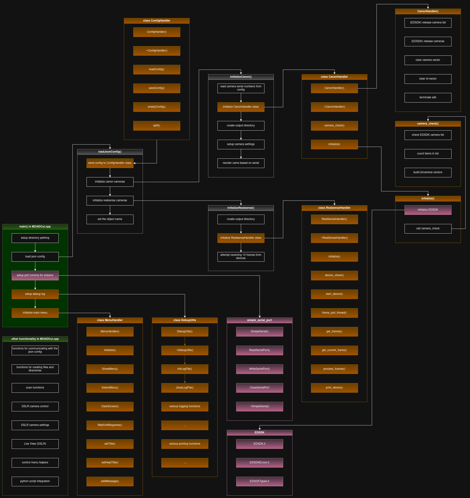

# MOAD CUI  

#### Official MOAD Website: [<https://www.robot-manipulation.org/nist-moad>]

## Quick Start
1. Clone this repo and simple_serial_port into a folder with EDSDK (For Linux v13.19.10) from Canon's website
2. Run bash script to auto-install packages.
3. Configure moad_config.json
4. Run:
```
cd moad_cui/
cmake --build build
sudo ./build/MultiCamCui
```


## Table of contents

  * [Quick Start](#Quick-Start)
  * [Pre-Requirements and Suggestions](#pre-requirements-and-suggestions)
  * [Requirements](#Requirements)
    * [Third Party Software](#Third-Party-Software)
    * [System Libraries and Packages](#System-libraries-and-packages)
  * [Json Config Setup](#Setting-up-the-JSON-Config)
  * [Transform Matrices](#Transformation-Matrices)
    * [Links to calibration tutorial docs](####Tutorial-Docs)
  * [Build and Run](#Build-and-run-the-software)
  * [Using the program](#Using-the-program)
    * [Control Menu](#Control-Menu)


Below is slightly more in-depth setup.

## Pre-Requirements and Suggestions
To minimize dependency pathing, I suggest cloning this repo into its own directory that we can place some of the required third party software alongside. 

**Target Directory Structure:**
```
moadrig_NERVE_location/
├── EDSDK/
├── moad_cui/ # <-- THIS REPO
│   ...
└── simple_serial_port/
    ├── linux/
    ...
```
The CMake file is setup for this structure.

...

**<u>Also, to avoid any potential auto-settings conflicts, I suggest unplugging all DSLR and Realsense cameras before installing requirements.</u>**

## Requirements:

#### This repo
Latest code is in branch `dev-linux`. Navigate into overall project folder (in the above directory tree, this is named `moadrig_NERVE_location/` as an example) and run:
```
git clone -b dev-linux https://github.com/pgavriel/moad_cui.git
```

#### Third Party Software
- **Canon `EDSDK`:**

Install instructions found here: [<https://developercommunity.usa.canon.com/s/article/How-do-I-apply-for-a-development-tool-SDK-API-Etc>], but also included below:

1. Register for an account, uses email verification, should end up on Canon home page.
2. Click "`SDK | API | DOWNLOADS`" on the option bar (should be one option as of 12/9/25).
3. Click "`EOS & POWERSHOT CAMERAS`".
4. Type in and submit information into their form that requests access to the SDK (this seems automated and for data collection, it will automatically allow you to download and use the software).
5. After submitting, click "`---->  Canon Developer Community Downloads  <---`"
6. This takes you back to the "`SDK | API | DOWNLOADS`" result screen, click on "`EOS & POWERSHOT CAMERAS`" again. 
7. The versions are set to Windows, click on the "`EDSDK FOR LINUX`" option.
8. Fill in form info again and submit, should be automated.
9. Click "`---->  Canon Developer Community Downloads  <---`" again.
10. Click "`EOS & POWERSHOT CAMERAS`" and "`EDSDK FOR LINUX`" again.
11. As of 12/9/25, the moadrig uses "`EDSDK v13.19.10 for Linux"`. Download by clicking on this version.
12. Extract into the overall project directory, make sure the repo structure matches the above visual, where `EDSDK/` has direct `Header` and `Library` subdirectories.


- **`simple_serial_port`:**

Original repo is from  [<https://github.com/dmicha16/simple_serial_port>] though it was made for windows. I have added a linux-capable version in a forked repo at [<https://github.com/grahamstelzer/simple_serial_port.git>].
1. `cd` into the overall project folder if you are not already there
2. run:
```
git clone https://github.com/grahamstelzer/simple_serial_port.git
```
*(note: the installation script in the next step will also attempt these two steps if the user allows it)*

<br>

#### System libraries and packages

All these have seperate install instructions, but for ease of usage I have consolidated the commands into a single bash script.

1. navigate into `moad_cui/`
```
cd moad_cui/
```
2. run install script

```
./install_requirements.sh
```

However, for the more skeptical and cautious individuals that like to make life slightly more difficult than necessary, included below are the official documentation and install readmes provided by each package:

- RealSense SDK: [<https://github.com/realsenseai/librealsense/blob/master/doc/installation.md>]
- OpenCV : [<https://docs.opencv.org/4.x/d7/d9f/tutorial_linux_install.html>] (links to source installation)
- PCL: [<https://pointclouds.org/downloads/>] (scroll down to linux version)
- Nholmann Json for Modern C++: [<https://github.com/nlohmann/json>]
- libudev: [<https://man7.org/linux/man-pages/man3/libudev.3.html>] (this should already be on a linux system but in case not, a line is included in the bash script)
  

#### After installing all these, you should be able to build with cmake and run the executable (feel free to test this), but we need to configure the moad_config.json file first or else the cameras will not be recognized and nothing will be saved correctly.


## Ok now plug the cameras in...

...but make sure to write down their serial numbers first. These are found all the cameras themselves OR on their packaging. They consist of 12 numbers. They need to be placed in the moad_config.json file BUT INSTRUCTIONS FOR THIS ARE INCLUDED IN THE NEXT STEP AND IN [config/CONFIG_OPTIONS.md](config/CONFIG_OPTIONS.md).

Mount the DSLR and Realsense cameras in the desired configuration and plug them into the PC.

**Ideally, connect them directly to the motherboard** (versus via usb hubs, wire extensions, etc). We have encountered many issues that have boiled down to slightly delayed or deteriorating connection between the software and hardware so this step is done in prevention of that.


## Setting up the JSON Config  

*Quick setup: type serial id numbers into the correct locations in moad_config.json, set the output directories, double check settings are configured correctly.*

In order to reduce the amount of rebuilding code during usage, an effort was made to paramaterize code using the text file `moad_config.json`, which allows the user to specify things like output directory, which data streams to collect, pointcloud filter options, COM port for motor control, delays, and timeouts.

In-depth explanations for each config value is included in [config/CONFIG_OPTIONS.md](config/CONFIG_OPTIONS.md). However, for starting up, I've included a few of the more important ones below:

- `dslr.camera_ids.{CAMERA_1 ... CAMERA_5}`: these are the camera serial ID numbers found on the bottom label of the physical device itself. You must enter them manually. This provides each camera with a consistent deterministic name based on serial number, such that terminal outputs and output files will reflect the camera with the specified serial number (i.e. CAMERA_1 -> cam1). For our rig, <u>we set CAMERA_5 to be directly over the object on the vertical axis and CAMERA_1 as the camera closest to side-on view (horizontal axis).</u>

- `object_name`: Meant to refer to the object currently being scanned, this will also affect the folder name of the directory that the images are output to. Example: `"bar-4mm"`. Note that this sets the initial object name when the program starts, but can be modified during runtime to scan new objects (see Control Menu).
- `output_dir`: Refers to the general output directory of where the named object folders will be. Example: `atb1`
- `realsense.rs_info.rs1 ... rs5`: This stores vital information that allows the realsense cameras to work and capture correctly oriented pointclouds.
  - `serial`: This number is 12 digits long and found on the Realsense cameras themselves or the box they are packaged in (ours were under the field S/N) and is used by the realsense SDK to send the commands to capture and save a pointcloud. 
  - `transform_matrix`: The matrix used to align the pointclouds with their real life orientations. **Instructions on how to get these are included in the next section with a short explanation.**
- `transform_generator`: These fields are meant for Python script that generates a transform matrix that aligns the DSLR cameras with their real life orientations. This is automatically run at the end of full scans.
  - `calibration_dir`: Location of the DSLR `alignment_tf.txt` and `transforms.json` in their respective zoom calibration folders (`55mm/` , `18mm/`). Example: `"../calibration"`
  - `calibration_mode`: Zoom level of the DSLR cameras. Example: `"55mm"`


## Transformation Matrices

*> something to note is that currently, the <u>DSLR transforms are stored in a directory called `calibration`</u> based on their zoom level (55mm, 18mm). The <u>Realsense transforms are stored in `moad_config.json`</u> and were previously in the same directory but were moved to cut down on some of the overhead in the Realsense code.*


#### Quick Guide

In order for the Realsense pointclouds to align correctly and for the Nerfacto reconstruction network to function correctly on the DSLR images, the algorithms need information about the positioning of the cameras relative to each other and the turntable. This is accomplished for both types of cameras with the following methods (abstracted; meant for you to keep in mind while reading the instruction docs):

- DSLR: 
```
for each camera:
  take a picture

using colmap, 
  1. get dense pointcloud
  2. get individual camera transforms
  3. get camera intrinsics

using cloudcompare:
  1. manually align
  2. copy and save transformation matrices
```
- Realsense:
```
for each camera:
  take a raw pointcloud (unfiltered)

using cloudcompare:
  1. manually align
  2. copy and save transformation matrices
```

#### Tutorial Docs
Latest DSLR calibration instructions: [<https://docs.google.com/document/d/1jnYCCUdmyryIeSsuyZUs1_pchJEBfH6QofjJOnQRerQ/edit?usp=sharing>]

Realsense calibration: [<https://docs.google.com/document/d/18nGBK1lqk_UkK3qeKK1O4t33_pRx8Umx7rD395rmtt8/edit?usp=sharing>]


## Build and Run the software
1. `cd` into `moad_cui/`
2. Create build directory (only necessary on fresh install)
```
cmake -S . -B build
```
3. Run
```
cmake --build build
```

To build everything in `build/` directory.

4. Run
```
sudo ./build/MultiCamCui
```

Note: in our case, we needed root perms for the file creation that occurs during scanning.


## Using the program
At this point, everything is probably setup correctly. After running, should see the control menu come up. However, before this, you can read the cli outputs. They are set up for inline coloring.

<mark style="background-color: aquamarine; color: black;">Aquamarine refers to any Realsense information</mark>

<mark style="background-color: magenta; color: black;">Magenta refers to any DSLR information</mark>

<mark style="background-color: grey; color: black;">Grey refers to any serial port information</mark>

<mark style="background-color: black; color: yellow;">Yellow text refers to any file/directory creation information</mark> (specifically just yellow text, black highlight is for readability)

Any other text outputs usually refer to outputs from the MOADCui.cpp where main() occurs.


### Control Menu:
*For a detailed explanation of each Control Menu option, see [CONTROL_MENU.md](CONTROL_MENU.md).*

For startup and getting things to work however, only some of the more used/vital options will be given.

Initially, the name of the object should be the one that the user specified in moad_config.json before running the executable. The pose and turntable position are less important at this stage.

Recommendation: run option `3  Collect Single Data`, and see if you receive DSLR and realsense images into the correct filepath location. Unfortunately, though we have tried to remove as many of the hardcoded filepaths as possible during development, there may be some inconsistancies. However, there should be CLI outputs for all output locations.

If this works correctly, try selecting and changing options `4  Set Object Name` and `5  Set Pose` and see the results in the command line. Also try changing the object_name and pose fields in the actual moad_config.json, then selecting `0  Reload Config`.

After this, the next step is to try a full scan. Select `1  Full Scan` and see if it works.

Finally, if everything runs with no issues, the last recommendation is to look at your DSLR image output, and tweak any settings so that the lighting is not too dark or too washed out. The settings can be altered through the Control Menu and is best accomplished by first selecting option `9  Live View...`, starting up the Live View, then returning to the main screen and selecting `7  Camera Options...`. This will allow you to tweak camera settings while getting a preview of the result. Remember to turn off the Live View before trying to run any of the scans.


## Debugging:

### Execution flow:


### DevLog

(needs cleaning)